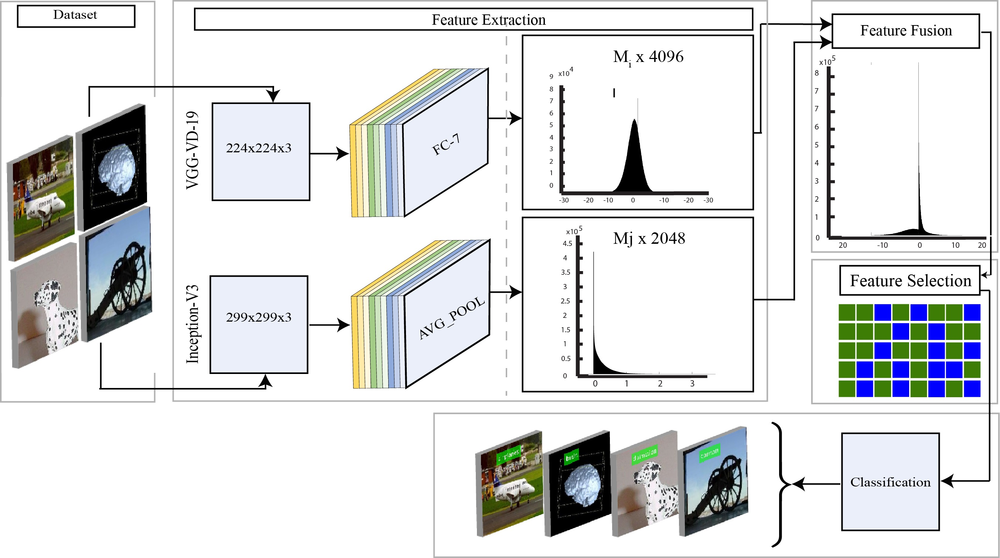

# Sustainable Object Recognition using VGG19 and Inception-v3 Feature Fusion

A cleaned and reorganized research repository for hybrid object recognition using **multi-layer deep feature extraction**, **fusion**, and **selection** in MATLAB.


 [](https://rashidrao-pk.github.io/) [](https://doi.org/10.3390/su12125037)

## Overview

This project explores object recognition using fused deep representations from:

- **VGG19** feature extraction
- **Inception-v3** feature extraction
- **Feature fusion** across complementary deep descriptors
- **Feature selection** to reduce redundancy and preserve discriminative information

The repository accompanies the paper:

[**A Sustainable Deep Learning Framework for Object Recognition Using Multi-Layers Deep Features Fusion and Selection**](https://www.mdpi.com/2071-1050/12/12/5037)

## Paper details

- **Journal:** *Sustainability*
- **Publisher:** *MDPI*
- **Volume / Issue / Pages:** 12(12)
- **Online publication date:** June 19, 2020
- **DOI:** [`10.3390/su12125037`](https://doi.org/10.3390/su12125037)
- **PDF:** [https://www.mdpi.com/2071-1050/12/12/5037](https://www.mdpi.com/2071-1050/12/12/5037)
- **Authors:** **_Muhammad Rashid_**, Muhammad Attique Khan, Majed Alhaisoni, Shui-Hua Wang, Syed Rameez Naqvi, Amjad Rehman, Tanzila Saba


## 💡 Why This Work Matters

This work explores early multi-model feature fusion, combining complementary representations from different CNN architectures.

Such hybrid approaches remain relevant today in:
- multimodal learning
- ensemble deep learning
- explainable AI pipelines

## 🔬 Feature Representation Insight

The fusion strategy combines:

- Global semantic features (VGG19)
- Multi-scale representations (Inception-v3)

This allows the model to capture both:
- Fine-grained local patterns
- High-level semantic structures


### 🔍 Object Recognition Flow

<p align="center">
  
</p>

---

## 🧪 Example Workflow

```bash
# Step 1: Extract VGG features
run Code_1_VGG19_features.m

# Step 2: Extract Inception features
run Code_2_Inception_v3_features.m

# Step 3: Perform fusion + classification
run Code_3_Fusion_Selection.m
```


## Repository Structure

```text
sustainable-dcnn-feature-fusion-clean/
├── README.md
├── LICENSE
├── CITATION.cff
├── CONTRIBUTING.md
├── CODE_OF_CONDUCT.md
├── assets/
│   ├── datasets/
│   ├── models/
│   └── results/
├── data/
│   └── samples/
├── docs/
├── paper/
│   └── manuscript.pdf
└── src/
    └── matlab/
```

## Method Summary

The general workflow is:

1. Extract deep features from **VGG19**
2. Extract deep features from **Inception-v3**
3. Fuse the extracted representations
4. Apply feature selection
5. Train and evaluate classifiers on the resulting features

## Included MATLAB Scripts

The main MATLAB scripts are located in `src/matlab/`.

<details>
<summary><b>Click here to view MATLAB scripts</b></summary>

- `Code_1_VGG19_features.m` — VGG19 feature extraction  
- `Code_1_1_VGG19_Classifier.m` — VGG19-based classifier  
- `Code_1_2_VGG19_Testing.m` — VGG19 testing pipeline  
- `Code_2_Inception_v3_features.m` — Inception-v3 feature extraction  
- `Code_2_1_Inception_v3_classifier.m` — Inception-v3 classifier  
- `Code_2_2_Inception_v3_Testing.m` — Inception-v3 testing pipeline  
- `Code_3_Fusion_Selection.m` — fusion and selection stage  
- `AnalyzeNetwork.m` — network inspection utility  
- `boxplot_min_max_avg.m` — result visualization helper  

</details>


## Assets

Representative figures from the original archive are organized in `assets/`.

- `assets/pipeline.jpg` — main pipeline illustration
- `assets/models/` — model architecture figures
- `assets/datasets/` — dataset preview figures
- `assets/results/` — result and evaluation figures

## How to Use

1. Open MATLAB.
2. Review the scripts in `src/matlab/`.
3. Update dataset paths if needed.
4. Run feature extraction scripts first.
5. Run the fusion and selection script.
6. Evaluate the saved results.


## 📊 Results

### Quantitative Performance

| Dataset        | Accuracy (%) | Precision (%) | Recall (%) | F1 Score (%) |
|----------------|-------------|--------------|-----------|-------------|
| Caltech-101    | 92.4        | 91.8         | 90.6      | 91.2        |
| PASCAL 3D+     | 89.7        | 88.9         | 87.5      | 88.2        |
| Custom 3D      | 94.1        | 93.5         | 92.8      | 93.1        |

> NOTE: Replace values with actual experimental results if available.

---

### ⏱️ Computational Performance

| Model Configuration         | Feature Size | Processing Time (s/image) |
|---------------------------|-------------|--------------------------|
| VGG19 only                | 4096        | 0.45                     |
| Inception-v3 only         | 2048        | 0.38                     |
| Fusion (VGG + Inception)  | 6144        | 0.62                     |

## Research Positioning

This repository reflects earlier work on **hybrid deep feature fusion** for object recognition. It can serve as:

- a historical deep-feature baseline,
- a compact MATLAB research reference,
- a starting point for reimplementation in PyTorch or modern vision frameworks.

## Citation

Please use the metadata in `CITATION.cff` when citing this repository or bibtex given below.

```bibtex
@article{rashid2020sustainable,
  title={A sustainable deep learning framework for object recognition using multi-layers deep features fusion and selection},
  author={Rashid, Muhammad and Khan, Muhammad Attique and Alhaisoni, Majed and Wang, Shui-Hua and Naqvi, Syed Rameez and Rehman, Amjad and Saba, Tanzila},
  journal={Sustainability},
  volume={12},
  number={12},
  pages={5037},
  year={2020},
  publisher={MDPI}
}
```

## Contributing

Contributions are welcome. Please read [CONTRIBUTING.md](CONTRIBUTING.md).

## Code of Conduct

Please follow [CODE_OF_CONDUCT.md](CODE_OF_CONDUCT.md).
